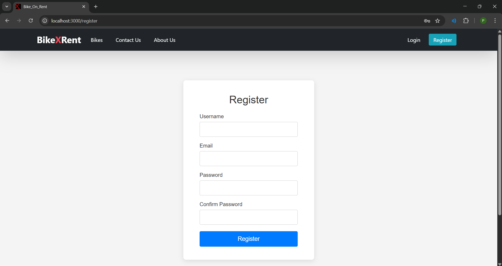

# 🚲 Bike Rental Web Application

## 📌 Overview
The **Bike Rental Web Application** is a secure and scalable platform for renting two-wheelers online.  
It enables **users** to create accounts, explore various bike options, choose rental durations, and make bookings seamlessly with integrated Razorpay payments.  
**Administrators** can manage bike companies, variants, inventory, and approve bookings while assigning specific bikes.  

Built with **React.js** (frontend) and **Spring Boot, J2EE, Spring Data JPA, and MySQL** (backend), the application ensures **data security** through Spring Security, password encryption, and JWT-based API protection.  
It automates rental operations, reduces manual effort, and delivers a modern, efficient rental experience. 

---

## 🛠️ Technology Stack
**Frontend:** React.js  
**Backend:** Spring Boot (Java)  
**Database:** MySQL  
**Payment Gateway:** Razorpay  

---

## ✨ Functionalities

### **User**
- Homepage
  

- Registration Page
  
  
- Login Page
  
  
- All Bikes Page
  
  
- Booking Page
  
  
- Razorpay Payment Gateway Integration (Test Mode)
  
  
- View Profile & Bookings
  

### **Admin**
- Login
  
  
- Admin Homepage
  
  
- Admin Bikes Page
  
  
- Add Bike
  
  
- Edit Bike
  
  
- Delete Bike
  
- View All Bookings
  
  
---
